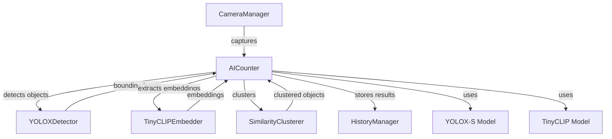

# System Architecture

This document describes the high-level architecture of the Object Counting System, which leverages AI-powered detection and clustering to count objects in images. The system is implemented for iOS using Swift, Core ML, and integrates two main machine learning models: YOLOX-S for object detection and TinyCLIP for visual embedding extraction.

## Overview

The system is composed of the following main components:
- **AICounter (Main Controller):** Orchestrates the entire counting pipeline, manages model lifecycle, and handles errors.
- **YOLOXDetector:** Performs object detection using the YOLOX-S model.
- **TinyCLIPEmbedder:** Extracts visual embeddings from detected objects using the TinyCLIP model.
- **SimilarityClusterer:** Clusters detected objects based on visual similarity.
- **CameraManager:** Handles camera input and image capture.
- **HistoryManager:** Manages persistence and retrieval of counting history.
- **Core ML Models:** Includes `yolox_s.mlpackage` and `tinyclip_vision.mlpackage`.

## Component Diagram (Mermaid)

### Diagram Explanation
- **CameraManager:** Captures images and sends them to the main controller.
- **AICounter:** Central orchestrator, receives images, manages the pipeline, and coordinates all subcomponents.
- **YOLOXDetector:** Receives images, runs object detection, and returns bounding boxes.
- **TinyCLIPEmbedder:** Receives cropped object images, extracts visual embeddings.
- **SimilarityClusterer:** Groups objects based on embedding similarity.
- **HistoryManager:** Persists counting results and history.
- **YOLOX-S Model:** Core ML model for object detection.
- **TinyCLIP Model:** Core ML model for visual embedding extraction.

## Platform Architecture
- **iOS 15+**
- **Swift 6.1+**
- **Core ML** for on-device inference
- **SwiftData** for persistence (if needed)
- **SwiftUI** for UI

## Key Flows
- Image capture → Detection → Embedding → Clustering → Counting → Result display/storage

---
