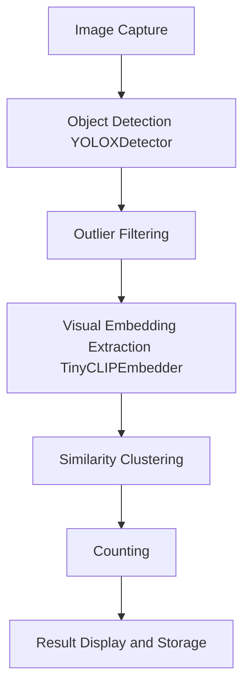

# Data Flow

This document describes the data flow through the Object Counting System, from image capture to result storage.

## Data Flow Stages

1. **Image Capture**
   - The user captures or selects an image using the CameraManager.
2. **Object Detection**
   - The image is sent to YOLOXDetector, which detects all potential objects and outputs bounding boxes.
3. **Outlier Filtering**
   - Detected objects are filtered for size and aspect ratio outliers to remove noise.
4. **Visual Embedding Extraction**
   - Each filtered object is cropped and passed to TinyCLIPEmbedder, which generates a normalized embedding vector.
5. **Similarity Clustering**
   - Embeddings are clustered using SimilarityClusterer to group visually similar objects.
6. **Counting**
   - The largest cluster is identified, and its size is used as the object count.
7. **Result Display & Storage**
   - The count and related data are displayed to the user and stored via HistoryManager.

## Data Flow Diagram (Mermaid)

### Diagram Explanation
- **Image Capture:** User action to provide an image.
- **Object Detection:** YOLOXDetector finds all possible objects.
- **Outlier Filtering:** Removes detections that are too small, large, or oddly shaped.
- **Visual Embedding Extraction:** TinyCLIPEmbedder generates a feature vector for each object.
- **Similarity Clustering:** Groups objects by visual similarity.
- **Counting:** The largest group is counted as the main object type.
- **Result Display & Storage:** Final count is shown to the user and saved for history.

## Data Structures
- **Image:** Raw or preprocessed image data.
- **Detection:** Bounding box, confidence, and other metadata.
- **Embedding:** 256-dim normalized vector from TinyCLIP.
- **Cluster:** Group of similar objects.
- **CountResult:** Final count and associated metadata.

---
