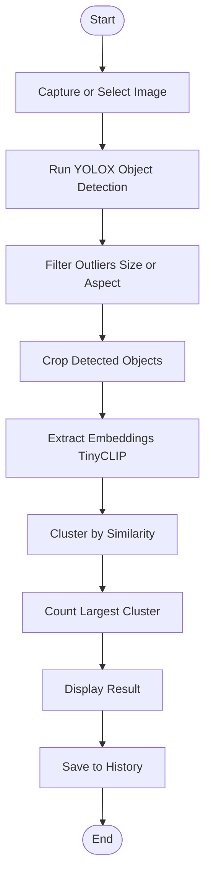

# Activity Diagram

This document presents the activity diagram for the object counting workflow, illustrating the main steps and decision points.

## Activity Diagram (Mermaid)

### Diagram Explanation
- **Start:** Entry point of the workflow.
- **Capture or Select Image:** User provides an image via camera or gallery.
- **Run YOLOX Object Detection:** Detects all objects in the image.
- **Filter Outliers:** Removes detections that are not within expected size/aspect ratio.
- **Crop Detected Objects:** Crops each detected object for embedding extraction.
- **Extract Embeddings (TinyCLIP):** Generates a 256-dim feature vector for each object.
- **Cluster by Similarity:** Groups objects using agglomerative clustering.
- **Count Largest Cluster:** Determines the count of the main object type.
- **Display Result:** Shows the count to the user.
- **Save to History:** Persists the result for future reference.
- **End:** Workflow completion.

---
