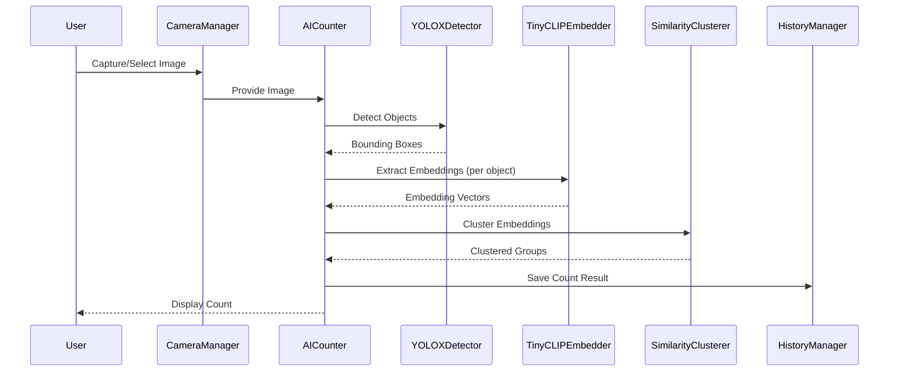

# Sequential Diagram

This document provides a sequence diagram for the object counting process, showing the interactions between system components.

## Sequence Diagram (Mermaid)

### Diagram Explanation
- **User:** Initiates the process by capturing or selecting an image.
- **CameraManager:** Handles image acquisition and passes it to the main controller.
- **AICounter:** Orchestrates the workflow, calling each subcomponent in order.
- **YOLOXDetector:** Detects objects and returns bounding boxes.
- **TinyCLIPEmbedder:** Extracts feature vectors for each detected object.
- **SimilarityClusterer:** Groups objects by visual similarity.
- **HistoryManager:** Stores the result for future reference.
- **User:** Receives the final count displayed in the UI.

---
