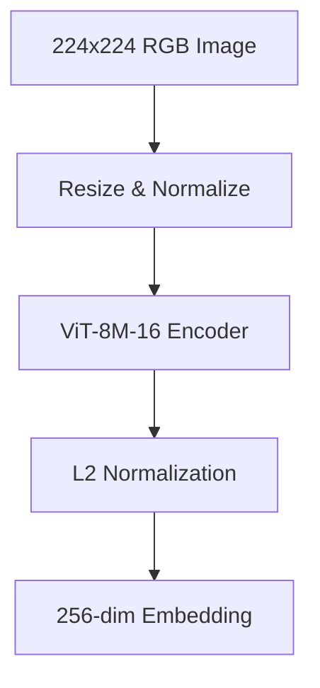

# TinyCLIP Vision Model

This document provides a detailed introduction to the `tinyclip_vision` model, including its specification, usage, and example.

## Model Specification
- **Architecture:** Vision Transformer (ViT-8M-16)
- **Input Shape:** [1, 3, 224, 224] (RGB image)
- **Output:** 256-dimensional L2-normalized embedding vector
- **Preprocessing:**
  - Resize to 224x224
  - Normalize with mean=[0.48145466, 0.4578275, 0.40821073], std=[0.26862954, 0.26130258, 0.27577711]
  - Scale pixel values from [0, 255] to [0, 1]
- **Core ML Format:** `.mlpackage` (iOS 15+)
- **Compute Units:** CPU, GPU, Neural Engine
- **Model Size:** ~16 MB
- **Training Dataset:** YFCC15M

## Usage
- **Input:** Cropped object image (224x224 RGB)
- **Output:** 256-dim normalized embedding vector
- **Purpose:** Provides a compact visual representation for each detected object, enabling similarity-based clustering.

## Example (Swift)
```swift
let model = try TinyCLIP_vision(configuration: MLModelConfiguration())
let input = TinyCLIP_visionInput(image: myCroppedImage)
let output = try model.prediction(input: input)
let embedding = output.var_651 // [Float] of length 256
```

## Example (Python, Core ML Tools)
```python
import coremltools as ct
mlmodel = ct.models.MLModel('tinyclip_vision.mlpackage')
result = mlmodel.predict({'image': my_image_array})
embedding = result['var_651']
```

## Model Diagram (Mermaid)


### Diagram Explanation
- **Input:** Cropped object image.
- **Preprocess:** Resizes and normalizes the image.
- **ViT-8M-16 Encoder:** Vision Transformer backbone extracts features.
- **L2 Normalization:** Ensures output is a unit vector.
- **Output:** Embedding used for similarity clustering.

## Notes
- The model is used for visual similarity, not classification.
- Embeddings are clustered to group visually similar objects.

---
