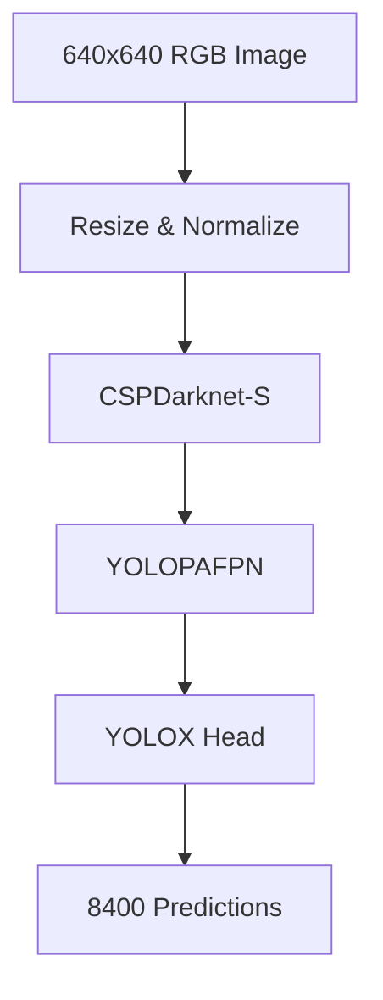

# YOLOX-S Model

This document provides a detailed introduction to the `yolox_s` model, including its specification, usage, and example.

## Model Specification
- **Architecture:** YOLOX-S (class-agnostic object detection)
- **Backbone:** CSPDarknet-S
- **Input Shape:** [1, 3, 640, 640] (RGB image)
- **Output:** [1, 8400, 85] (bounding boxes, objectness, class scores)
- **Preprocessing:**
  - Resize to 640x640
  - Scale pixel values from [0, 255] to [0, 1]
  - Color layout: RGB
- **Core ML Format:** `.mlpackage` (iOS 15+)
- **Compute Units:** CPU, GPU, Neural Engine
- **Model Size:** ~17 MB
- **Parameters:** ~9M

## Output Format
- **Shape:** [1, 8400, 85]
- **Features:**
  - Indices 0-3: Bounding box (x_center, y_center, width, height)
  - Index 4: Objectness score
  - Indices 5-84: Class scores (COCO classes, not used in class-agnostic mode)

## Usage
- **Input:** Full image (640x640 RGB)
- **Output:** List of detected bounding boxes with confidence scores
- **Purpose:** Detects all potential objects in the image for further processing

## Example (Swift)
```swift
let model = try yolox_s(configuration: MLModelConfiguration())
let input = yolox_sInput(image: myImage)
let output = try model.prediction(input: input)
let detections = output.var_1430 // MLMultiArray [1, 8400, 85]
```

## Example (Python, Core ML Tools)
```python
import coremltools as ct
mlmodel = ct.models.MLModel('yolox_s.mlpackage')
result = mlmodel.predict({'image': my_image_array})
detections = result['var_1430']
```

## Model Diagram (Mermaid)


### Diagram Explanation
- **Input:** Full image to be analyzed.
- **Preprocess:** Resizes and normalizes the image.
- **CSPDarknet-S:** Backbone for feature extraction.
- **YOLOPAFPN:** Feature pyramid for multi-scale detection.
- **YOLOX Head:** Outputs bounding boxes and scores.
- **Output:** 8400 predictions per image.

## Notes
- Used in class-agnostic mode (objectness only).
- Output is post-processed to filter by confidence and remove outliers.

---
